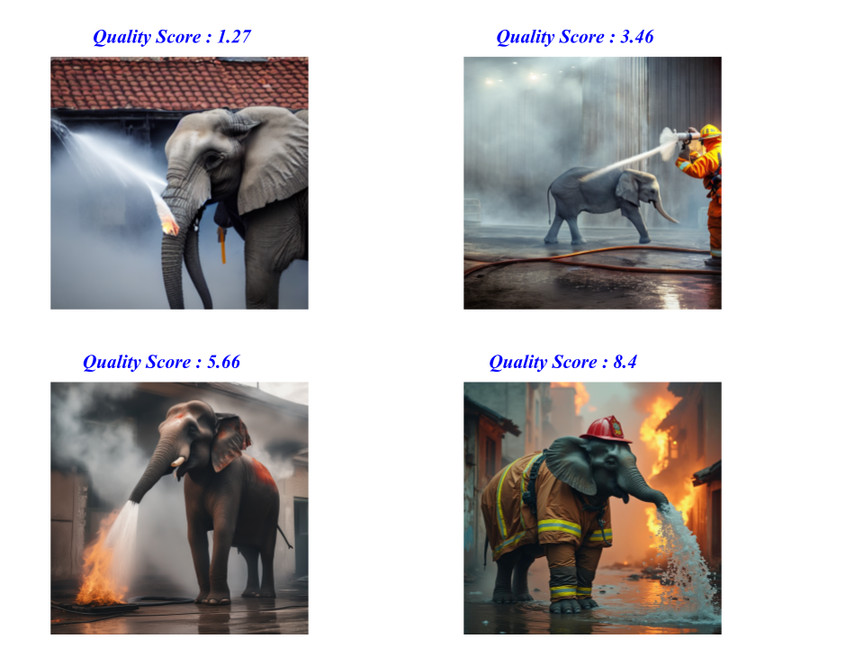

# 🖼️ Image Quality Evaluator

Image Quality Evaluator is a deep learning-based toolkit for automatically assessing the perceptual quality of images. It predicts a numerical quality score using a Convolutional Neural Network (CNN) model, fine-tuned on a custom dataset.

---

## ✨ Example Results

Below are example images evaluated by the model. The visual quality varies, and the model predicts a numerical quality score for each:

<div align="center">
  
  
</div>

<p align="center">
  <b>Left: Example 1 &nbsp;|&nbsp; Right: Example 2</b>
</p>

---

## 🛠️ Installation

**Prerequisites:**
*   Python >= 3.8
*   `pip` (Python package installer)


1.  🗂️ **Clone the repository (optional):**
    ```bash
    git clone https://github.com/egeyavuzcan/image-quality-evaluator.git
    cd image-quality-evaluator
    ```
2.  🛠️ **Install the package:**
    Navigate to the project's root directory (where `pyproject.toml` is located) in your terminal and run:
    ```bash
    pip install -e .
    ```
    *   The `-e` flag installs the package in "editable" mode, meaning changes to the source code in the `src` directory will be effective immediately without reinstalling.
    *   The `.` tells pip to install from the current directory.
    *   This command will automatically install all dependencies listed in `pyproject.toml` (like PyTorch, torchvision, scikit-learn, etc.).

*   **Modifications:** The final fully connected layer (`fc`) of the ResNet50 is replaced with a new sequence:
    1.  A `Dropout` layer (default dropout rate 0.5) to prevent overfitting.
    2.  A `Linear` layer that maps the ResNet features to a **single output neuron**, representing the predicted quality score.
*   **Loss Function:** Mean Squared Error (MSE) loss (`nn.MSELoss`) is used, suitable for regression tasks.
*   **Optimizer:** Adam optimizer (`optim.Adam`) with weight decay.
*   **Scheduler:** `ReduceLROnPlateau` learning rate scheduler monitors the validation loss and reduces the learning rate if no improvement is seen for a set number of epochs.

## 🚀 Usage

After installing the package, you can use the command-line tools defined in `pyproject.toml`:

---

## 🖼️ Example Results

Here are some example images and their predicted quality scores:

<p align="center">
  
  <br>
  <b>Example 1</b>
</p>

<p align="center">
  
  <br>
  <b>Example 2</b>
</p>

---

*   📁 Ensure your dataset is correctly placed and structured within the `data/` directory.
*   🛠️ Run the training script from your terminal:
    ```bash
    iqe-train
    ```
*   The script will:
    *   Load data from the default `DATASET_DIR`.
    *   Split data into training and validation sets.
    *   Define transformations (including augmentation for training).
    *   Initialize the fine-tuned ResNet50 model.
    *   Train the model for the specified number of epochs, using the configured optimizer, loss function, and LR scheduler.
    *   Evaluate the model on the validation set after each epoch.
    *   Save the model with the best validation loss to the `output/` directory (default: `output/best_quality_model.pth`).
    *   Implement early stopping if validation loss doesn't improve for a defined patience period.

**2. 🔍 Inference:**

*   🖼️ To predict the quality score for one or more images using a trained model:
    ```bash
    iqe-infer path/to/image1.jpg path/to/image2.png ...
    ```
    *   Replace `path/to/image...` with the actual paths to your image files.
    *   By default, it loads the model from `output/best_quality_model.pth`.
*   To specify a different model file:
    ```bash
    iqe-infer path/to/image.jpg -m path/to/your_model.pth
    ```
    *   Use the `-m` or `--model-path` argument.

## 📦 Dependencies

Core dependencies are managed by `pyproject.toml` and installed automatically:

*   `torch`
*   `torchvision`
*   `numpy`
*   `scikit-learn`
*   `Pillow` (PIL fork)
*   `tqdm`

Refer to `pyproject.toml` for specific version requirements if needed.